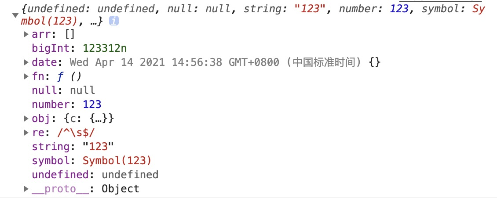
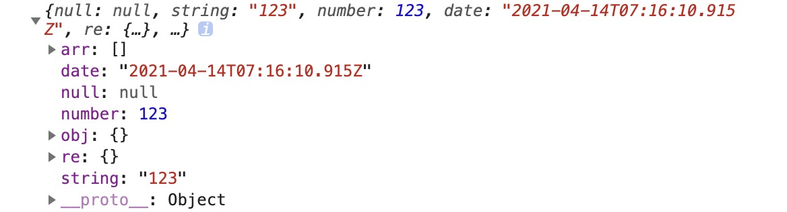

# 深拷贝


## 浅拷贝

浅拷贝只是创建了一个对象，赋值了原有对象基本类型的值，而引用类型只拷贝了一层属性，再深层的还是无法拷贝。

### 1. Object.assign

Object.assign()方法用于对象的合并，将源对象（source）的所有可枚举属性，复制到目标对象（target）。

```js
let object = {
  'undefined': undefined,
  'null': null,
  'string': '123',
  'number': 123,
  'symbol': Symbol(123),
  'bigInt': BigInt(123312),
  'fn': function () { },
  'date': new Date(),
  're': new RegExp(/^\s$/),
  'arr': [],
  'obj': {
  }
}
object.obj.a = object
Object.defineProperty(object, 'innumerable' ,{
  value:'不可枚举属性',
  enumerable:false
});
let cloneObj = {}
Object.assign(cloneObj, object);
```
。

但是使用 object.assign 方法有几点需要注意：

- 他不会拷贝对象的继承属性。
- 他不会拷贝对象的不可枚举属性。

### 2. 扩展运算符

```js
let object = {
  'undefined': undefined,
  'null': null,
  'string': '123',
  'number': 123,
  'symbol': Symbol(123),
  'bigInt': BigInt(123312),
  'fn': function () { },
  'date': new Date(),
  're': new RegExp(/^\s$/),
  'arr': [],
  'obj': {
  }
}
object.obj.a = object
Object.defineProperty(object, 'innumerable' ,{
  value:'不可枚举属性',
  enumerable:false
});
let cloneObj = {...obj}
```

。

扩展运算符 和 object.assign 有同样的缺陷，也就是实现的浅拷贝的功能差不多，但是如果属性都是基本类型的值，使用扩展运算符进行浅拷贝会更加方便。

### 3. 手工实现一个浅拷贝

- 对基本数据类型做一个最基本的拷贝
- 对引用数据类型开辟一层新的存储，并拷贝一层对象属性。

```js
function clone (target) {
  if (typeof target === 'object' && target !== null) {
    const cloneTarget = Array.isArray(target) ? [] : {};
    for (let key in target) {
      cloneTarget[key] = target[key];
    }
    return cloneTarget;
  } else {
    return target
  }
}
```

## 深拷贝

将一个对象从内存中完整的拷贝出来一份给目标对象。并从堆内存中开辟一个新的内存存放新对象，且新对象的属性修改不会影响到原对象，二者实现真正的分离。

深拷贝后两个对象是独立的、不受影响的。彻底实现了内存上的分离。

### 1. JSON.stringify 和 JSON.parse

JSON.stringify() 是目前开发过程中最简单的深拷贝方法，其实就是把一个对象序列化成为 JSON 的字符串，并将对象里面的内容转换成字符串，最后再用 JSON.parse() 的方法将JSON 字符串生成一个新的对象。示例代码如下所示。

```js
var obj = {
  'undefined': undefined,
  'null': null,
  'string': '123',
  'number': 123,
  'symbol': Symbol(123),
  // 'bigInt': BigInt(123312),
  'fn': function () { },
  'date': new Date(),
  're': new RegExp(/^\s$/),
  'arr': [],
  'obj': {}
}
// obj.obj.c = obj;
Object.defineProperty(obj, 'innumerable' ,{
  value:'不可枚举属性',
  enumerable:false
});

console.log(JSON.parse(JSON.stringify(obj)))
```


使用 JSON.parse 需要注意一下几个点：

- 拷贝的对象如果有 undefined、symbol、function 这几种类型，经过序列化后，健值对中健值对会消失
- BigInt、循环引用、不可枚举属性无法拷贝
- 拷贝 Date 会从引用数据类型转换成字符串
- 拷贝 RegExp 引用类型会变成空对象
- 对象中含有 NaN、Infinity 以及 -Infinity，JSON 序列化的结果会变成 null

### 手写递归实现

- 如果是基本数据类型无需拷贝，直接返回。
- 如果是引用数据类型，创建一个新的对象，遍历要克隆的对象m，将需要克隆的对象属性执行深拷贝后添加到新对象上。

```js
function clone(target) {
  if (typeof target === 'object' && target !== null) {
    let newTarget = {};
    for (let key in target) {
      newTarget[key] = clone(target[key]);
    }
    return newTarget;
  } else {
    return target;
  }
}
```

#### 考虑数组

```js
function clone(target) {
  if (typeof target === 'object' && target !== null) {
    let newTarget = Array.isArray(target) ? [] : {};
    for (let key in target) {
      newTarget[key] = clone(target[key]);
    }
    return newTarget;
  } else {
    return target;
  }
}
```

#### 循环引用

```js
function clone(target, map = new WeakMap()) {
  if (typeof target === 'object' && target !== null) {
    if (map.get(target)) return map.get(target);
    map.set(target, target);

    let newTarget = Array.isArray(target) ? [] : {};
    for (let key in target) {
      newTarget[key] = clone(target[key], map);
    }
    return newTarget;
  } else {
    return target;
  }
}
```

#### 其他数据类型

```js
function cloneFunction(func) {
  const bodyReg = /(?<={)(.|\n)+(?=})/m;
  const paramReg = /(?<=\().+(?=\)\s+{)/;
  const funcString = func.toString();
  if (func.prototype) {
    const param = paramReg.exec(funcString);
    const body = bodyReg.exec(funcString);
    if (body) {
      console.log('匹配到函数体：', body[0]);
      if (param) {
        const paramArr = param[0].split(',');
        console.log('匹配到参数：', paramArr);
        return new Function(...paramArr, body[0]);
      } else {
        return new Function(body[0]);
      }
    } else {
      return null;
    }
  } else {
    return eval(funcString);
  }
}
function isObject(target) {
  const type = typeof target;
  return target !== null && (type === 'object' || type === 'function');
}

function getType(target) {
  return Object.prototype.toString.call(target);
}

function getInit(target) {
  const Ctor = target.constructor;
  return new Ctor();
}

function clone(target, map = new WeakMap()) {
  // 克隆原始数据类型
  if (!isObject(target)) {
    return target;
  }
  
  // 初始化
  let cloneTarget;

  // 防止循环引用
  if (map.get(target)) return map.get(target);
  map.set(target, target);

  // 克隆 Date
  if (getType(target) === '[object Date]') {
    return new Date(target)
  }

  // 克隆 正则
  if (getType(target) === '[object RegExp]') {
    return new RegExp(target);
  }

  // 克隆函数
  if (getType(target) === '[object Function]') {
    return cloneFunction(target)
  }

  // 克隆 set
  if (getType(target) === '[object Set]') {
    target.forEach((value) => {
      cloneTarget.add(clone(value, map));
    })
    return cloneTarget
  }

  // 克隆 map
  if (getType(target) === '[object Map]') {
    target.froEach((value, key) => {
      cloneTarget.set(key, clone(value, map));
    })
    return cloneTarget
  }

  // 克隆对象和数组
  cloneTarget = Array.isArray(target) ? [] : {};
  for (let key in target) {
    cloneTarget[key] = clone(target[key], map);
  }
  return cloneTarget;
}
```